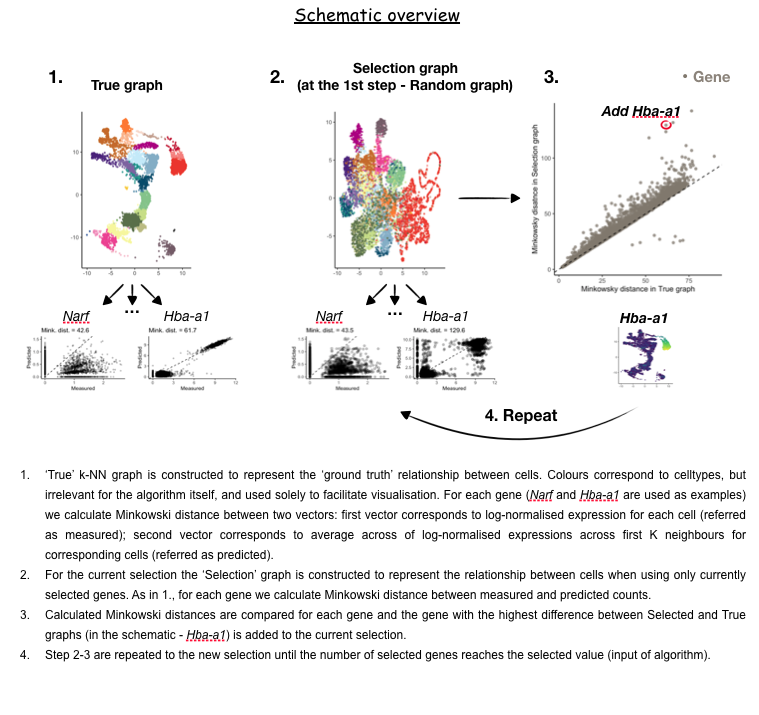

# geneBasisR

`geneBasis` is an approach to select an optimal gene library (based on scRNA-seq data) as a function of designated number of genes. 
Essentially, we attempt to identify all sources of heterogeneity driving transcriptional relationships between cells, represented in the form of k-NN graph. For greater details on the method, read our paper. 


<p align="center">
  
</p>


### Installation

```
## Install development version
devtools::install_github("MarioniLab/geneBasisR", ref="devel") 
```

### Main usage

Main functions of the package are `gene_search` and `evaluate_library`.

`gene_search` takes as inputs scRNA-seq data (as a SingleCellExperiment objects, using logcounts) and number of genes to select.

`evaluate_library` takes as inputs scRNA-seq data (as a SingleCellExperiment objects, using logcounts) and charcter vector of gene names, and estimates the quality of the selected library at cell type, cell and gene levels. Note that this is independent from `gene_search` meaning that you can plug any selection you want and assess how ~complete it is.

Explore vignette and tutorials to get a grasp on the package and its functions.


### Tutorials

1. [Extended vignette of library design and its evaluation for mouse embryo, E8.5](https://rawcdn.githack.com/MarioniLab/am_geneBasis/main/analysis/make_tutorials_4_package/geneBasis_mouseEmbryo_extended.html)

2. Add-on: illustration of `geneBasis` within an individual cell type + suggestion for how to preselect relevant genes.
[Vignette of library design within brain cells, mouse embryo, E8.5](https://rawcdn.githack.com/MarioniLab/am_geneBasis/main/analysis/make_tutorials_4_package/geneBasis_mouseEmbryo_within_celltype.html)


