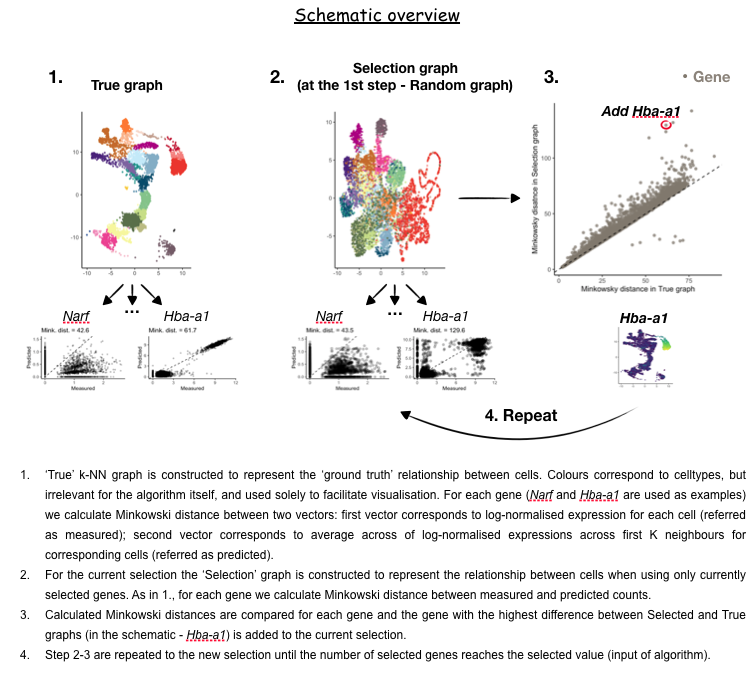

# geneBasisR

`geneBasisR` is a package that:

- Selects an optimal targeted gene panel (based on scRNA-seq data) as a function of designated number of genes. 

- Provides evaluation of any selected gene panel on -cell type/-cell and -gene levels. 

For greater details on the method, please read our paper: https://www.biorxiv.org/content/10.1101/2021.08.10.455720v1. Also, explore vignette and tutorials to get a better grasp on the package and its functions.

### Installation

```
## Install development version
library(devtools)
devtools::install_github("MarioniLab/geneBasisR") 
```


### Gene panel selection

`gene_search` is the main function of the package and it selects the gene panel of designated size. The schematic below illustrates the steps of the algorithm.

<p align="center">
  
</p>

Essential to specify arguments of `gene_search` are counts matrix (stored in SingleCellExperiment object or henceforth *sce*) and *n_genes_total* specifying the size of the panel. 

Requirements for scRNA-seq data format:

- SingleCellExperiment object, containing assay 'logcounts'. Henceforth this SingleCellExperiment object will be referred to as sce.

- Rownames of sce correspond to unique gene identifiers.

- If colData(sce) contains field 'cell', this field should correspond to unique identifiers of cell entries (if not, we use colnames(sce) for cell IDs instead).

Few notes:

- If the initial gene screening (e.g. HVG selection) has not been performed, use `retain_informative_genes` prior to `gene_search`.

- `gene_search` works in iterative fashion and adds genes one by one. The practicality of this is if the initially chosen n_genes_total returned the selection that seems to be insufficient, the selected panel can be plugged back in (specified *genes_base*) to avoid the repetition and discover additional to the selection genes.


```
library(geneBasisR)

# sce - SingleCellExperiment object, wehre normalized counts stored in 'logcounts' assay
# discard definetely uninteresting genes
sce = retain_informative_genes(sce)

# run gene selection
genes = gene_search(sce, n_genes_total = 50)

```

### Gene panel evaluation

We evaluate gene panels on next levels:

- cell type: for each cell type, we estimate how often cells from the cell type are assigned with the correct cell type based on their neighbors in the 'selection' graph.

- cell: for each cell, we compare normalized distances between neighbors in 'true' and 'selection' graphs. 

- gene: for each gene, we assess imputation accuracy based on the average expression values across cell's neighbors in the 'selection' graph.

The wrapper function that performs evaluation is `evaluate_library` takes as inputs scRNA-seq data (as a SingleCellExperiment objects, using logcounts) and character vector of gene names.

Few notes:

- This function is independent from `gene_search` meaning that you can plug any selection you want and assess how ~complete it is.

- For assessment of accuracy of cell type mappings, you need to provide cell type labels. We require that it is stored in colData(sce). The default name for the field is 'celltype' - in case, it differes, please specify it in the argument *celltype.id*.


### Tutorials

1. In-built vignette provides the main workflow to select and evaluate gene panel for mouse embryo. Additionally, it displays visualization functions to provide further insights of the selected panels and, finally, displays how to compute cell type mapping redundancy for the selected panel. Also can be assessed via link below:
[Vignette of library design and its evaluation for mouse embryo, E8.5](https://rawcdn.githack.com/MarioniLab/geneBasis_tutorials/b692ca1939937535204ee55a34ecc6ab3f9b2e41/geneBasis_mouseEmbryo.html)


**Additional tutorials for further exploration of the package:**

2. Extended version of in-built vignette where we provide further suggestions how to proceed with detailed evaluation of the selected gene panels: [Extended vignette of library design and its evaluation for mouse embryo, E8.5](https://rawcdn.githack.com/MarioniLab/geneBasis_tutorials/eb746577190c2326e311a1289eb8f779dd4f9e9f/geneBasis_mouseEmbryo_extended.html)

3. Illustration of performance of **geneBasis** within an individual cell type + suggestion (functional) how to pre-select relevant for the cell type genes:
[Vignette of library design within brain cells, mouse embryo, E8.5](https://rawcdn.githack.com/MarioniLab/geneBasis_tutorials/eb746577190c2326e311a1289eb8f779dd4f9e9f/geneBasis_mouseEmbryo_within_celltype.html)

4. Here we introduce how to create correct sce object from raw .txt data (exemplified for spleen) and introduce a gene panel evaluation workflow to compare two independent selections. [Vignette of library design for spleen dataset](https://rawcdn.githack.com/MarioniLab/geneBasis_tutorials/055b5e181c5cbe99f7aa0c3f655c38cd06ac942e/geneBasis_spleen.html)


